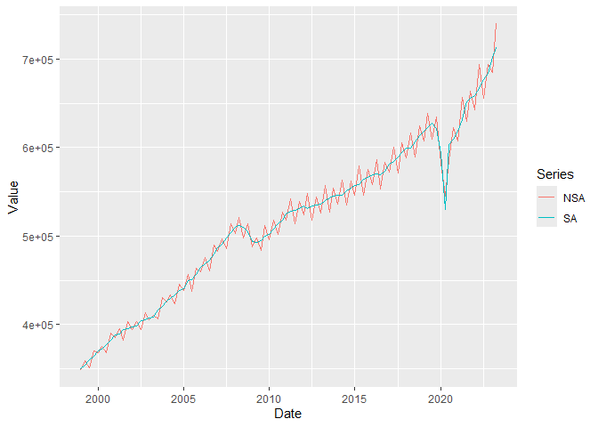
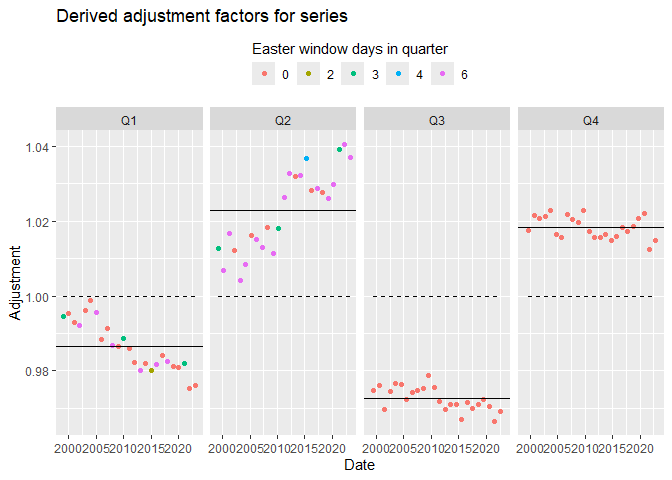

<!-- README.md is generated from README.Rmd. Please edit that file -->

# SAvalidation

[](https://seasadjwg.r-universe.dev/SAvalidation)

SAvalidation provides simple functions for running validation checks on
seasonally adjusted time series and generating dashboards for further
analysis of validation checks.

## Installation

You can install the development version of SAvalidation like so:

``` r
# Using r-universe
install.packages('SAvalidation', repos = c('https://seasadjwg.r-universe.dev', 'https://cloud.r-project.org'))
```

Other solution using devtools:

``` r
# install.packages("devtools")
devtools::install_github("SeasAdjwG/SAvalidation")
```

## Example

This code shows how to run a simple level 1 validation check on a pair
of time series (the unadjusted and seasonally adjusted):

``` r
library(SAvalidation)
level1_validation(data_to_check$nsa, data_to_check$sa)
#> [1] "PASS:"                                                              "NSA SERIES HAS EVIDENCE OF SEASONALITY AND NSA != SA"              
#> [3] "SA SERIES HAS NO EVIDENCE OF RESIDUAL SEASONAL OR CALENDAR EFFECTS" "ANNUAL TOTALS CHECK PASSED"                                        
#> [5] "NO NEGATIVE VALUES IN THE SA SERIES"                                "OVER-ADJUSTMENT CHECK PASSED"
```

A level 2 validation report can be created with `level2_validation()`
which returns an html dashboard either in current working directory or a
user specified directory:

``` r
level2_validation(data_to_check$nsa, data_to_check$sa, data_to_check$name)
```

You can also create plots from level 2 validation code for example the
NSA against the SA:

``` r
nsa_sa_plot(data_to_check$nsa, data_to_check$sa)
```



Or the derived adjustment factor plot:

``` r
adjust_fact_plot(data_to_check$nsa, data_to_check$sa)
#> Joining with `by = join_by(quarter, year)`
```



## Example Pipeline

SAvalidation includes a **full example pipeline** that demonstrates
reading SDMX data, performing level 1–3 validations, and generating HTML
reports.

### Locate the pipeline script

Once the package is installed, you can find the example pipeline script
and the test XML data file using `system.file()`:

``` r
# Path to the pipeline script
pipeline_path <- system.file("scripts", "pipeline_example.R", package = "SAvalidation")

# Path to the test SDMX file
xml_path <- system.file("extdata", "NAMAIN_T01GDP_Q_2024_0002.xml", package = "SAvalidation")

pipeline_path
xml_path
```

### Run the pipeline

You can run the pipeline by sourcing the script:

``` r
source(pipeline_path)
```
